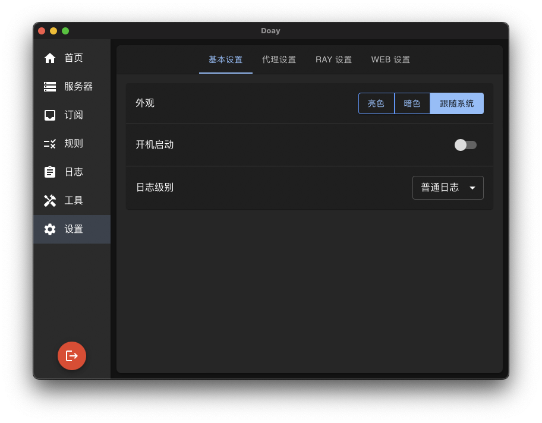

# Doay

基于 Rust + TypeScript 开发的跨平台 Xray GUI 客户端，采用现代化架构设计，现已支持 MacOS、Windows 和 Linux，未来计划移植至
iOS 和 Android 平台

## 名字由来

- dog + day = Doay
- Doay 是一只每天都爱笑的小狗，时间久了，眯眼眯到看不清世界，最后连毛都笑绿了
  

## 支持协议

- VLESS / VMESS / Shadowsocks / Trojan / SOCKS / HTTP / HTTPS

## 界面预览

| 设置                 | 工具                 |
|--------------------|--------------------|
|  |  |

### macOS 安装温馨提示

由于 Doay 没有开发者签名，macOS 会显示“无法验证开发者”或“应用已损坏”的提示。你可以通过以下两种常见方法解决该问题：

#### 方法 1: 系统偏好设置允许打开

- 打开“系统偏好设置” > “安全性与隐私”，在“通用”选项卡下，你会看到关于 Doay 的提示，点击“仍然允许”即可。

#### 方法 2: 使用终端解除安全隔离

通过以下命令，解除 macOS 对 Doay 的安全隔离限制：

```bash
sudo xattr -r -d com.apple.quarantine /Applications/Doay.app
```

> **注意**：只有在你确定应用来源安全时，才应使用该命令。

## 设计宗旨

- 极简设计：界面简洁直观，操作路径最短化
- 零学习成本：新手用户无需教程即可上手使用
- 轻量高效：核心功能突出，避免功能臃肿
- 跨平台设计：考虑移植成本，简化程序架构设计

## 架构优势

- 跨平台：支持 MacOS、Windows 和 Linux，未来计划移植至 iOS 和 Android 平台
- 极致性能：基于 Rust 构建的高性能后端，资源占用低，执行效率媲美 C/C++
- 内存优化：相比 Swift、Golang、Java、C# 等语言，Rust 内存占用更低，性能更优
- 代码健壮：强类型语言 Rust + TypeScript，显著降低 Bug 发生率
- 维护便捷：现代化架构设计，TypeScript 构建前端，依托 Web 生态，保证高效开发和便捷维护
- 灵活扩展：低耦合架构设计，可轻松移植 Flutter、Electron 等技术栈，可快速扩展至 iOS、Android 等平台

## 特色功能

- 启动极快：Doay 可在 1 秒内完成启动，从点击到界面显示几乎无延迟，提升使用体验
- 安装包小：安装包仅 20 MB 左右，节省下载时间
- 易用规则：访问（路由）规则配置简单灵活，小白用户易上手，高阶用户也能自由配置，可简可繁
- DNS 设置：DNS 规则直观强大，普通用户可轻松使用，进阶用户可按需细调
- 多种导入：支持手动添加、剪切板导入、二维码识别（摄像头、截图、图片文件）
- 多种主题：内建浅色与深色主题，可自动适配系统外观，也支持手动切换，贴合用户使用习惯
- 贴心订阅：不仅支持 JSON 接口链接，还支持 HTML 页面订阅，更方便获取免费机场节点
- 日志查看：独创彩色日志查看器，支持 GB 级大日志的流畅浏览，智能高亮关键信息，大幅提升问题排查效率
- 系统监控：实时监测 CPU、内存、磁盘、温度与网络资源，百分比展示，清晰掌握系统运行状况
- 任务管理：查看并管理系统进程，支持结束任务和资源监控，更高效定位异常程序
- 请求测试：便捷发送 HTTP 请求，支持查看请求头与 HTML 源码，方便连接验证代理服务器和接口调试
- 网速测试：内置公网 IP 查看、Ping、抖动和上下行网速测试，真实反映代理服务器的网络带宽与连接质量
- 端口扫描：高效扫描本机或远程主机的开放端口，支持设置扫描范围、线程数与超时时间，助力网络安全检测
- 流量统计：实时监控网络流量，分类展示上传/下载情况，辅助识别异常网络行为
