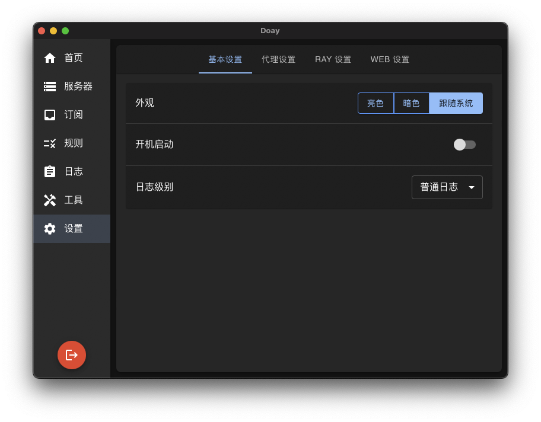
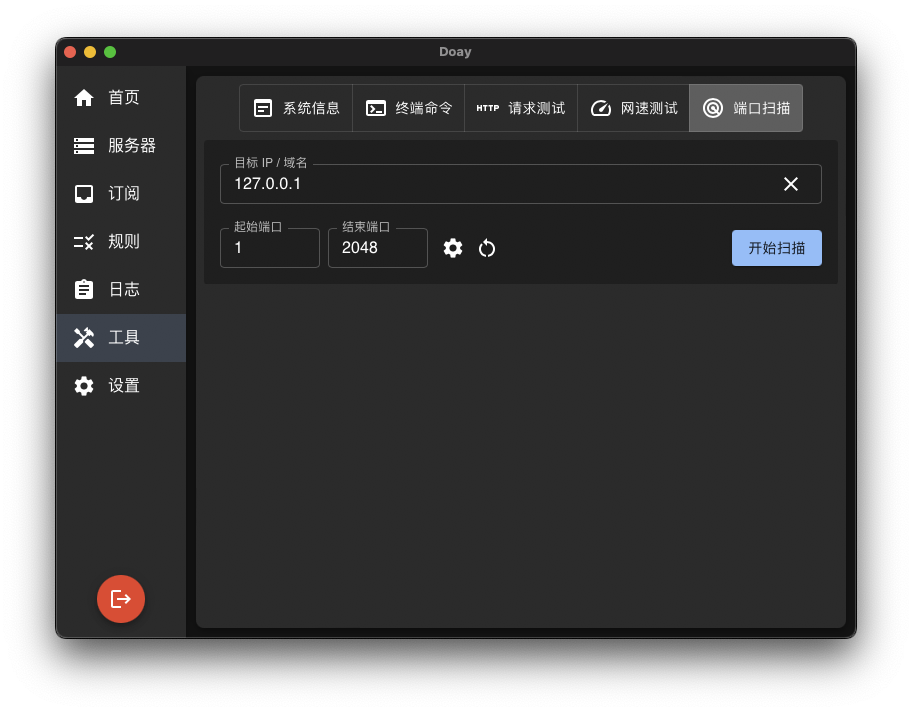

## 界面预览

| 设置                 | 工具                 |
|--------------------|--------------------|
|  |  |

## macOS 安装温馨提示

由于 Doay 没有开发者签名，macOS 会显示“无法验证开发者”或“应用已损坏”的提示。你可以通过以下两种常见方法解决该问题：

### 方法 1: 系统偏好设置允许打开

- 打开“系统偏好设置” > “安全性与隐私”，在“通用”选项卡下，你会看到关于 Doay 的提示，点击“仍然允许”即可。

### 方法 2: 使用终端解除安全隔离

- 通过以下命令，解除 macOS 对 Doay 的安全隔离限制：

```bash
sudo xattr -r -d com.apple.quarantine /Applications/Doay.app
```

> **注意**：只有在你确定应用来源安全时，才应使用该命令。
